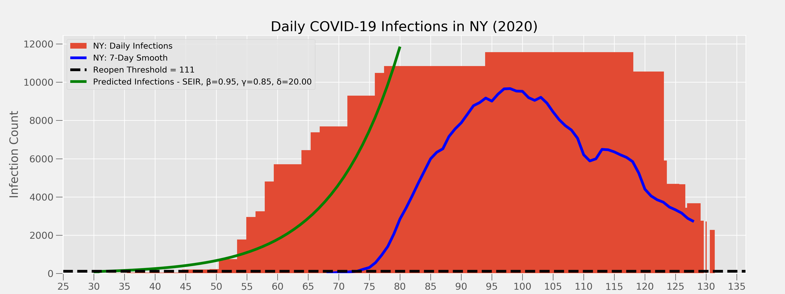

# Safe to Reopen?  COVID-19 Infection Forecasting

---
## Motivation

As of mid-May 2020, various policies have been adopted in the US for roughly 2 months to reduce infection rates of COVID-19.  These policies vary widely from state to state, as well as city to city, and have become sources of social tension and political debate.

An evidence-based approach needs to be a leading part of the conversation to shape policy.  Specifically, based on the infection data, **when will a region's infection rate be low enough to justify relaxing policies and measures around lockdowns / stay-at-home and even social distancing?**

---
## Background

The CDC has defined 3 metrics around relaxing shelter-at-home / social distancing policies:
1. **Infection Rates** dropping below a threshold (see below)
2. **Increased testing** on the general population (positive tests shouls be on the order of 2% - currently in the 15%-20% range)
3. A **contact tracing** system in place to throughly isolate all parties related to each now reported infection.

Infection rate data is widely available and updated daily, so provides a good opportunity to understand how regions may / may not be approaching the first metric. 

### Incidence Threshold
The CDC defines low incidence as 10 or fewer new cases per 100,000 people over a period of 14 days. This rate is equivalent to **0.71 new cases per 100,000 people per day**, or about 2,300 new cases per day in the United States.

---

## Raw Data Description

The raw data used is a [Kaggle dataset](https://www.kaggle.com/sudalairajkumar/covid19-in-usa) (which pulls from the COVID-19 tracking project) andis updated daily.  It provides new and cumulative counts of infections, hospitalizations, deaths, and testing by state by day.  See table below.

| Field Name                    | Description                       |
|-------------------------------|-----------------------------------|
|`datetime`                     | Date                              |
|`d_o_y`                        | Day of year (Jan 1st, 2020 = 1)   |
|`state_name`                   | State Name                        |
|`state_id`                     | State 2-character Postal Code     |
|`state_pop_2019`               | State Population (2019)*          |
|`positive_daily_incr`          | Positive Test Results, New        |
|`positive_cum`                 | Positive Test Results, Cumulative |
|`negative_daily_incr`          | Negative Test Results, New        |
|`negative_cum`                 | Negative Test Results, Cumulative |
|`pending_daily`                | Pending Test Results, New         |
|`death_daily_incr`             | Deaths, New                       |
|`death_cum`                    | Deaths, Cumulative                |
|`recovered_cum`                | Recovered Patients, Cumulative    |
|`hospitalized_daily_incr`      | Hospitalized Patients, New        |
|`hospitalized_cum`             | Hospitalized Patients, Cumulative |
|`total_test_results_daily_incr`| Total Test Results, New           |
|`total_test_results_cum`       | Total Test Results, Cumulative    |
|`total_tests_cum`              | Total Tests, Cumulative (incl 'Pending')  |

\* Population data by state (estimated for end of year 2019) was included from the [US Census](https://www2.census.gov/programs-surveys/popest/datasets/2010-2019/state/detail/SCPRC-EST2019-18+POP-RES.csv) website.

---

## EDA - Time Series Processing

The data is simply daily and cumulative counts - bar charts are most appropriate to explore this.

### Infections

Hard to see all states on one y-axis, and a log scale loses some vertical perspective.

### Deaths

### Weekly Trends

A 7-day cyclic behavior can be seen in infection rates and deaths for most states (as well as world countries).  Infections and Deaths are lowest on Mondays and Tuesdays; highest on Thursdays and Friday.

It's unclear what drives this trend; i.e., if it's an artifact of patient's behavior with medical care, a lag in reporting data on certain days, etc.  

This periodicity needs to be smoothed.  A 7-day rolling average was applied to the data for fitting with against models.

Additionally, the target line of "0.71 infections / 100,000 population / day" (= 111 people for NY) has been added.

## Infectious Disease Model Overview
 
### SIR Model
 A compartmental model used to model infectious diseases; where every individual in a population is assigned to a compartment based on their condition.  The most basic of these models is an SIR model, where all indiviuals are in one of 3 states at any given time:
 - **(S)** usceptible
 - **(I)** nfected
 - **(R)** ecovered
 
 and individuals transition from one state to another following a system of differential equations.

 **Generic SIR Model Flow:**

  

Where the state transitions are given by:

  

The sum of the 3 compartments is a constant (the population, N), and the sum of the derivatives of all compartments must be 0.

In an epidemic, initially the entire population (less some initial infected number, I0) is healthy and in the **S**useptble compartment.  Individuals can transition from **S**usceptble to **I**nfected at a rate proportional to some constant, and transition from **I**nfected to **R**ecovered at a rate proportinal to some other constant:

- **β** - Average number of people an infected person infects each day 
- **γ** - the proportion of infected people recovering each day (1/γ = duration a person is infected)
 
- **R0** - Total number of people an infected person infects (R0 = β / γ)

Equations for an SIR Model:

### SEIR Model
Generic SEIR Model Flow:

This adds in an **(E)** xposed compartment, where an individual has contracted the virus but can't yet infect others (incubation period).  This brings a new rate variable, δ.

- **δ** - the rate at which exposed people become infected/infectious (1/δ = incubation period)

Equations for an SEIR Model:

  

## Assumptions
- A given population is treated as homogenous (i.e., within a region/state, there are no population density or age impacts).  There is also assumed to be a single initial infection point per geographic area, and not multiple clusters.
- Each geographic region is self-contained (i.e., infections only come from existing sources within and not from travel, immigration, etc.)
- Infection data is accurate - Testing is widespread enough to catch nearly all the infections in the population. 
- This SIR/SEIR model assumes immunity upon recovery - this may be true with COVID-19, or true for a short time period, but has yet to be confirmed.  An SEIDS (or SEIRD, SEICDS, SEIRCDS, etc.!) may ultimately be a better approximation of the underlying situation.
- ...there are likely many others

## Models and Fits

The SEIR base model with population N=1000.

SEIR model - Infections and NY Infection data - "literature parameters"

SEIR model - Infections and NY Infection data - "closest overlay; nonsense parameters"

This model doesn't give a good enough fit to the data to predict any usable date for answering the intial question.  The three rate parameters don't seem to have a region of space to fit the data well.

## Next Steps
- The SEIR model used to try to fit the data was overly simplistic given the expected lack of full reporting of infected persons (low test prevalence).  Need to explore if additional complexity will address this issue.
- The x-axis is in day of year to allow offsetting the onset of infection in a region more easily - this needs to be enabled.
- The SEIR model also doesn't split out deaths from recovered - this would be useful to aiding in the next point.
- It was recommended by a contact in the epidemiological world to instead model deaths, and to use a MLE fit on a Poisson distribution.  This will be attempted on Capstone III.

### References
- [CDC COVID-19 Forecasts](https://www.cdc.gov/coronavirus/2019-ncov/covid-data/forecasting-us.html)
- [Columbia University Epidemiology Models](https://columbia.maps.arcgis.com/apps/webappviewer/index.html?id=ade6ba85450c4325a12a5b9c09ba796c)
- [Towards DataScience - *Infectious disease modelling beyond the basic SIR model*](https://towardsdatascience.com/infectious-disease-modelling-beyond-the-basic-sir-model-216369c584c4)
- [Center for American Progress - *Thresholds States Must Meet To Control Coronavirus Spread and Safely Reopen*](https://www.americanprogress.org/issues/healthcare/news/2020/05/04/484373/evidence-based-thresholds-states-must-meet-control-coronavirus-spread-safely-reopen-economies/)
- [Wikipedia - *Compartmental models in epidemiology*](https://en.wikipedia.org/wiki/Compartmental_models_in_epidemiology)

